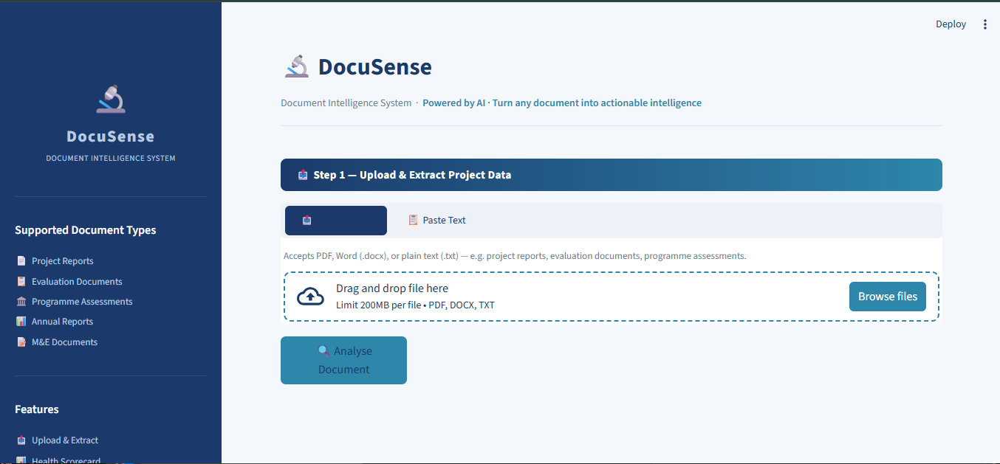
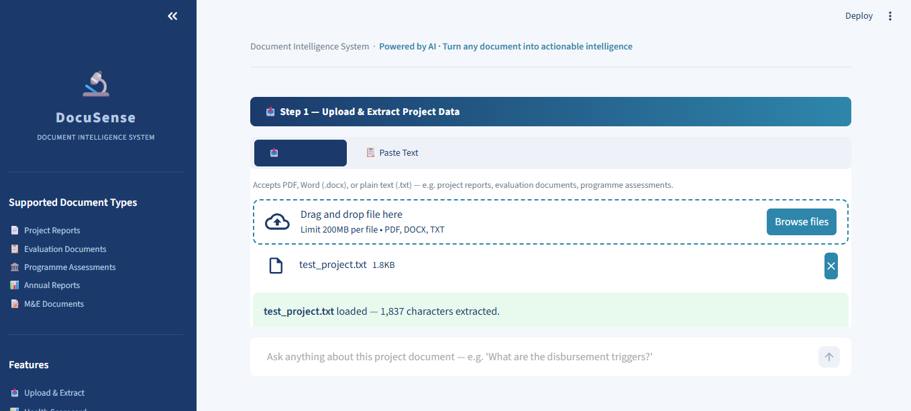
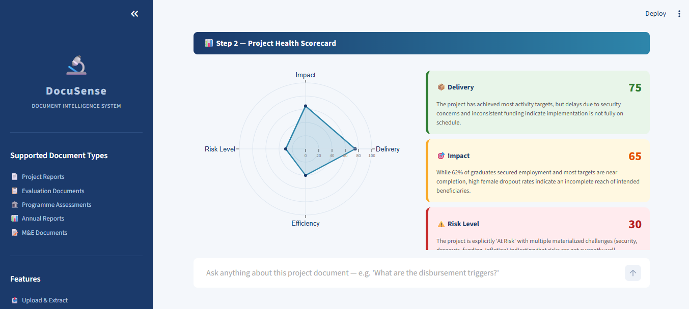
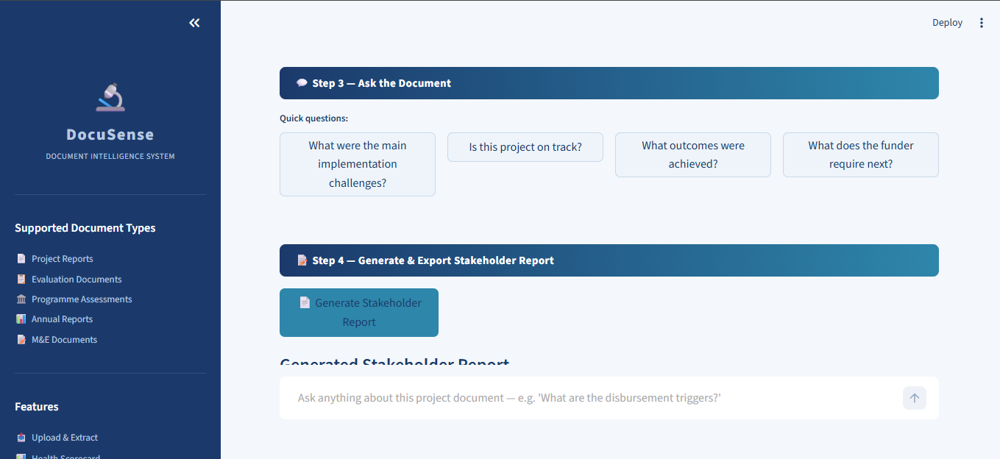

# 🔬 DocuSense
### AI-Powered Document Intelligence System

> Turn any project document into structured intelligence, health insights, and professional stakeholder reports — instantly.



---

## What is DocuSense?

DocuSense is a full-stack AI application that transforms raw project documents (PDFs, Word docs, plain text) into structured dashboards, health scorecards, and professional reports — powered by Google Gemini 2.5 Flash.

It solves a real problem: organisations managing complex, multi-stakeholder projects spend hours manually reading reports to extract key information and write stakeholder summaries. DocuSense automates that entire workflow in seconds.

---

## Features

### 📤 1. Upload & Extract
Upload a PDF, Word document, or paste raw text. DocuSense automatically extracts:
- Project Name, Funder & Implementing Organisation
- Objectives, Key Achievements, Challenges & Risks
- Recommendations & Project Status



### 📊 2. Project Health Scorecard
Automatically scores the project on 4 dimensions using LLM reasoning:
- **Delivery** — Is the project being implemented as planned?
- **Impact** — Is it achieving intended outcomes?
- **Risk Level** — How serious are the challenges?
- **Efficiency** — Is it making good use of resources?

Each dimension gets a score (0–100), a one-sentence justification, and a color-coded card (🟢 green / 🟡 amber / 🔴 red). Visualised as an interactive Plotly radar chart.



### 💬 3. Ask the Document
A grounded Q&A interface — ask any question about the uploaded document and get answers based strictly on its content. No hallucination, no outside knowledge injected.

Includes suggested quick-question buttons for common queries.



### 📝 4. Export Stakeholder Report
One click generates a complete professional narrative report including:
- Executive Summary
- Key Findings
- Risk Assessment
- Recommendations

Downloadable as a `.txt` file named after the project.

---

## How It's Different from ChatGPT

| Capability | ChatGPT / Claude.ai | DocuSense |
|---|---|---|
| Document handling | Manual copy-paste | Direct file upload |
| Output | Raw chat text | Structured dashboard |
| Extraction | You ask, it answers | Automatically extracts 7 fields |
| Health scoring | Not available | 4-dimension scorecard + radar chart |
| Report generation | You format manually | One-click professional report |
| Context | Resets every session | Full document held in session memory |

---

## Tech Stack

| Layer | Technology |
|---|---|
| Frontend | Streamlit |
| LLM | Google Gemini 2.5 Flash |
| Prompt Engineering | Structured JSON extraction, schema-anchored prompts |
| Document Parsing | PyMuPDF (PDF), python-docx (Word), UTF-8 (TXT) |
| Visualisation | Plotly (radar chart) |
| Configuration | python-dotenv |
| Language | Python 3.11 |

---

## Architecture

```
DocuSense/
├── app.py          # Streamlit frontend — UI, session state, CSS
├── extractor.py    # Document parsing + Gemini JSON extraction
├── scorer.py       # 4-dimension health scoring + Plotly chart
├── qa.py           # Grounded document Q&A
├── report.py       # Professional stakeholder report generation
└── .env            # API key (not committed)
```

**How it works:**

```
User uploads document
        ↓
Text extracted (PDF / DOCX / TXT)
        ↓
Gemini extracts structured JSON (temp=0.3)
        ↓
Gemini scores project health (temp=0.3)
        ↓
User asks questions → Gemini answers from document only
        ↓
One-click report → Gemini writes narrative (temp=0.7)
        ↓
Download as .txt
```

---

## Prompt Engineering Highlights

DocuSense uses three distinct prompting strategies:

- **Schema-anchored extraction** — The extraction prompt includes the exact JSON schema expected, forcing the model to return clean, parseable output every time
- **Role + rubric scoring** — The health scoring prompt assigns a senior evaluator persona and defines what each score range means on each dimension
- **Persona + tone control** — Report generation uses a professional technical writer persona with explicit tone instructions, producing formal stakeholder-ready language

Temperature is set to `0.3` for extraction and scoring (deterministic, consistent) and `0.7` for report writing (fluid, natural narrative).

---

## Getting Started

### Prerequisites
- Python 3.11+
- Google Gemini API key ([Get one free at Google AI Studio](https://aistudio.google.com))

### Installation

```bash
# Clone the repo
git clone https://github.com/JaneAjodo/DocuSense.git
cd DocuSense

# Create virtual environment
conda create -n docusense python=3.11 -y
conda activate docusense

# Install dependencies
pip install -r requirements.txt

# Add your API key
echo "GEMINI_API_KEY=your_key_here" > .env

# Run the app
streamlit run app.py
```

### Dependencies

```
streamlit
google-generativeai
pymupdf
python-docx
pandas
plotly
python-dotenv
```

---

## Roadmap

- [ ] Multi-document analysis — compare insights across a full project portfolio
- [ ] Vector database integration (pgvector) for proper RAG on long documents
- [ ] Persistent storage — save and revisit past analyses
- [ ] Natural language database queries — "Which projects are currently at risk?"
- [ ] Automated report distribution via email
- [ ] Fine-tuned extraction model for domain-specific document formats
- [ ] Docker containerisation for production deployment
- [ ] REST API backend (FastAPI) for integration into external apps

---

## Author

**Jane Ojoduwa Ajodo**
Machine Learning & AI Engineer
[LinkedIn](https://linkedin.com/in/jane-ajodo) · [GitHub](https://github.com/JaneAjodo)

---

## License

MIT License — feel free to use, modify, and build on this project.
